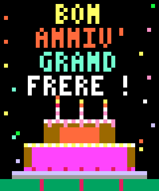

# 🎂 Disquette Spéciale Anniversaire pour Apple II (Bootable & Protégée)

Ce dossier contient la disquette spéciale amorçable pour Apple II créée comme cadeau d'anniversaire pour **"Grand Frère"**.

---

## 📸 Aperçu de l'Écran d'Accueil (GR 40×48)



---

## 🎮 Fonctionnalités & Comportement

1. **Boot Immédiat en Plein Écran GR Couleur (40×48)** :
   - Message festif rendu avec une police personnalisée 3×5 :
     - `BON` (Jaune `$D`)
     - `ANNIV'` (Orange `$9`)
     - `GRAND` (Cyan néon `$E`)
     - `FRERE !` (Cyan néon `$E` avec reflets lumineux animés)
   - Gâteau d'anniversaire sur deux étages avec glaçage fraise/chocolat, bougies rayées et plat argenté.
   - **Animations dynamiques** :
     - Vacillement organique à 3 phases des flammes de bougies.
     - Pluie de confettis multicolores isolée strictement sur les marges latérales (`X=1..4` et `X=35..38`) pour **ne jamais effacer ni trouer le texte ou le gâteau**.
     - Rafraîchissement automatique de netteté du texte toutes les 64 frames.
     - Étoiles scintillantes dans le ciel.
     - **Mélodie complète de "Joyeux Anniversaire"** (25 notes, les 4 phrases complètes) sur le haut-parleur `$C030` :
       - *Phrase 1* : Sol - Sol - La - Sol - Do - Si
       - *Phrase 2* : Sol - Sol - La - Sol - Ré - Do
       - *Phrase 3* : Sol - Sol - Sol(aigu) - Mi - Do - Si - La
       - *Phrase 4* : Fa - Fa - Mi - Do - Ré - Do
       - Flammes et confettis animés en rythme entre chaque note.
       - Interruption instantanée à la moindre milliseconde dès qu'une touche est pressée.

2. **Lancement Instantané d'Artillerie** :
   - Dès qu'une touche quelconque est pressée, la disquette charge et lance immédiatement le jeu **Duel d'Artillerie** (`artillerie.bin`) à son point d'entrée `$4000`.

3. **Verrouillage Total de la Touche Reset (Inopérante)** :
   - Le vecteur d'interruption Reset (`$03F2/$03F3`) et l'octet de contrôle (`$03F4 = $03F3 ^ $A5`) sont verrouillés.
   - Tout appui sur **RESET** (ou Ctrl-Reset) réinitialise la pile (`TXS`), réarme le piège et relance immédiatement la scène sans jamais permettre d'accéder au prompt Applesoft `]` ou au Moniteur système `*`.

4. **Disquette Impénétrable avec DOS Spécial** :
   - Commande `CATALOG` neutralisée dans la table du DOS 3.3 (renvoie `?SYNTAX ERROR`).
   - Le jeu principal **Duel d'Artillerie** est stocké en secteurs bruts sur les pistes 3 à 5 sans aucune entrée au catalogue (100% invisible).
   - Les fichiers système de boot sont verrouillés.

---

## 🛠️ Fichiers du Dossier

| Fichier | Description |
| :--- | :--- |
| **`ANNIVERSAIRE.DSK`** | **Image de disquette amorçable finale (143 360 octets).** |
| `birthday.asm` | Code source assembleur 6502 de l'écran GR, des flammes, confettis sécurisés, mélodie complète 25 notes et verrouillage Reset. |
| `birthday.bin` | Binaire compilé de l'intro (2 020 octets). |
| `build_birthday_disk.py` | Script Python automatisant la compilation et l'assemblage de la disquette. |
| `anniversaire_screen.png` | Rendu graphique du plein écran GR. |

---

## 🔨 Recompilation & Test

Pour régénérer la disquette :
```bash
python build_birthday_disk.py
```

Pour lancer dans AppleWin :
```bash
D:\Emulateurs\AppleWin\Applewin.exe -d1 ANNIVERSAIRE.DSK
```
